# Traffic Prediction Modules

# Table of Contents

 - [Table of Contents](#table-of-contents)
 - [Fully Connection LSTM(FC-LSTM)](#fully-connection-lstm)
 - [Gate Recurrent Unit(GRU)](#gate-recurrent-unit)
 - [General/Chebyshev Graph Convolution Layer](#generalchebyshev-graph-convolution-layer)
 - [Temporal Self-Attention Layer](#temporal-self-attention-layer)
 - [Diffusion Convolution Layer](#diffusion-convolution-layer)
 - [Gated Temporal Convolution Layer/Network](#gated-temporal-convolution-layernetwork)
 - [Spatial/Temporal Attention Layer](#spatialtemporal-attention-layer)
 - [Window Attention Layer](#window-attention-layer)
 - [Graph Update and Aggregate Network](#graph-update-and-aggregate-network)
 - [Spatial-Temporal Identity(STID)](#spatial-temporal-identity)
 - [Two-Stage Attention Layer](#two-stage-attention-layer)

---

#### Fully Connection LSTM

[Paper](https://arxiv.org/abs/1308.0850) 

*Generating Sequences With Recurrent Neural Networks*

[Code](./modules/fc_lstm.py)

[Diagram/Formula](https://arxiv.org/abs/1308.0850)

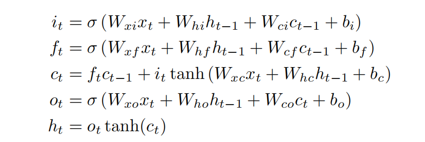

---

#### Gate Recurrent Unit

[Paper](https://arxiv.org/abs/1406.1078)

*Learning Phrase Representations using RNN Encoder-Decoder for Statistical Machine Translation* EMNLP'14

[Code](./modules/gru.py)

[Diagram/Formula](https://en.wikipedia.org/wiki/Gated_recurrent_unit)

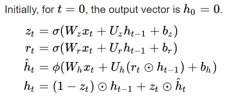

---

#### General/Chebyshev Graph Convolution Layer

[Paper](https://arxiv.org/abs/1609.02907)

*Semi-Supervised Classification with Graph Convolutional Networks* ICLR'17

[Code(General Graph Conv)](./modules/graph_conv.py)

[Code(Chebshev Graph Conv)](./modules/cheb_graph_conv.py)

[Official Code](https://github.com/tkipf/pygcn)

[Diagram/Formula](https://arxiv.org/abs/1609.02907)

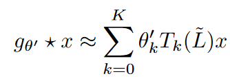

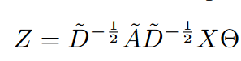

---

#### Temporal Self-Attention Layer

[Paper](https://arxiv.org/abs/1706.03762)

*Attention Is All You Need* NIPS'17

[Code](./modules/temporal_self_att.py)

[Related Repository](https://github.com/xmu-xiaoma666/External-Attention-pytorch)

*External-Attention-pytorch* 

[Diagram/Formula](https://arxiv.org/abs/1706.03762)

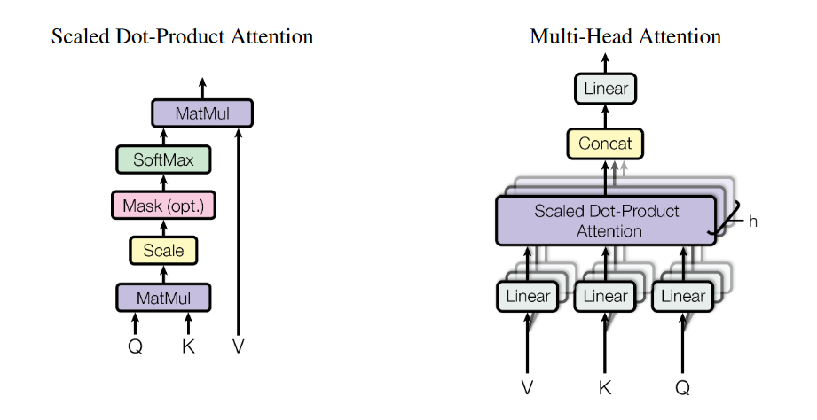

---

#### Diffusion Convolution Layer

[Paper](https://arxiv.org/abs/1707.01926) 

*Diffusion Convolutional Recurrent Neural Network: Data-Driven Traffic Forecasting* ICML'18

[Code](./modules/diffusion_conv.py)

[Official Code](https://github.com/liyaguang/DCRNN)

[Diagram/Formula](https://arxiv.org/abs/1707.01926)

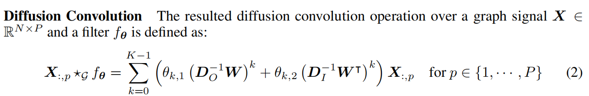

---

#### Gated Temporal Convolution Layer/Network

[Paper](https://arxiv.org/abs/1906.00121)

*Graph WaveNet for Deep Spatial-Temporal Graph Modeling* IJCAI'19

[Code(Gated TC Layer)](./modules/gated_temporal_conv.py)

[Code(Gated TCN)](./modules/gated_tcn.py)

[Official Code](https://github.com/nnzhan/Graph-WaveNet)

[Diagram/Formula](https://arxiv.org/abs/1906.00121)

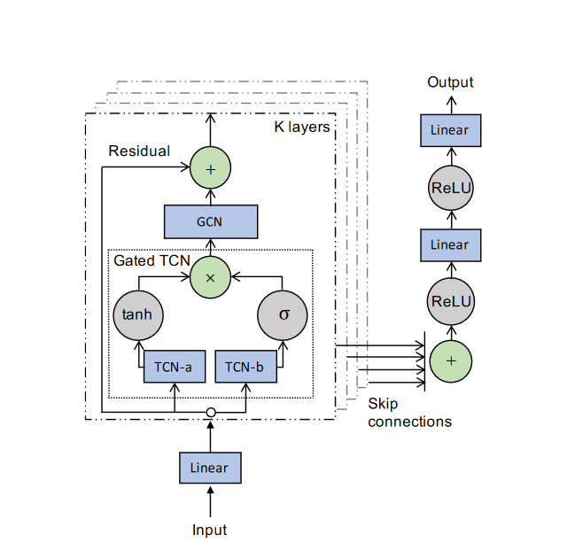

---

#### Spatial/Temporal Attention Layer

[Paper](https://ojs.aaai.org/index.php/AAAI/article/view/3881)

*ASTGCN: Attention Based Spatial-Temporal Graph Convolutional Networks for Traffic Flow Forecasting* AAAI'19

[Code(Spatial Attention Layer)](./modules/spatial_att.py)

[Code(Temporal Attention Layer)](./modules/temporal_att.py)

[Official Code](https://github.com/guoshnBJTU/ASTGCN-r-pytorch)

[Diagram/Formula](https://ojs.aaai.org/index.php/AAAI/article/view/3881)
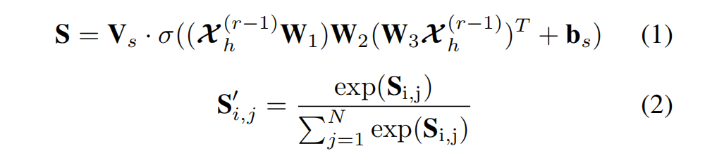

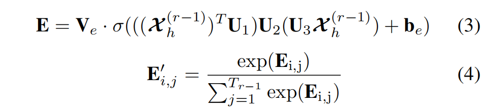

---

#### Window Attention Layer

[Paper](https://arxiv.org/abs/2203.15737) 

*Towards Spatio-Temporal Aware Traffic Time Series Forecasting* ICDE'20

[Code](./modules/window_att.py)

[Official Code](https://github.com/razvanc92/ST-WA)

[Diagram/Formula](https://arxiv.org/abs/2203.15737)

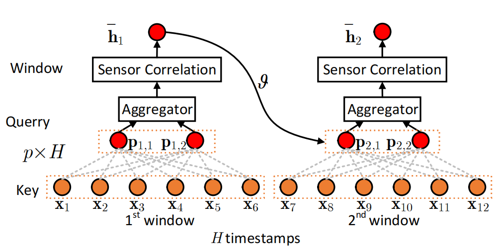

---

#### Graph Update and Aggregate Network

[Paper](https://arxiv.org/abs/2203.03965) 

*Few-Shot Traffic Prediction with Graph Networks using Locale as Relational Inductive Biases* TITS'22

[Code](./modules/graph_up_agg_nn.py)

[Official Code](https://github.com/MingxiLii/LocaleGN)

[Diagram/Formula](https://arxiv.org/abs/2203.03965)

$\bar{e}_{k}^{\prime\tau}=\phi ^E\left( \bar{e}_{k}^{\tau},\bar{v}_{tail\left( k \right)}^{\tau},\bar{v}_{head\left( k \right)}^{\tau} \right) ,\forall k,\tau \,\,\left( 1 \right) $

${\bar{e}^{\prime}}_{\rightarrow i}^{\tau}=\rho ^{E\rightarrow V}\left( \bar{E}_{\rightarrow i}^{\prime\tau} \right) , \forall i, \tau \,\,\left( 2 \right) $

$\bar{v}_{i}^{\prime\tau}=\phi ^V\left( {\bar{e}^{\prime}}_{\rightarrow i}^{\tau},\bar{v}_{i}^{\tau} \right) , \forall i, \tau \,\,\left( 3 \right)$

---

#### Spatial-Temporal Identity

[Paper](https://arxiv.org/abs/2208.05233)

*Spatial-Temporal Identity: A Simple yet Effective Baseline for Multivariate Time Series Forecasting* CIKM'22

[Code](./modules/stid.py)

[Official Code](https://github.com/zezhishao/STID)

[Diagram/Formula](https://arxiv.org/abs/2208.05233)

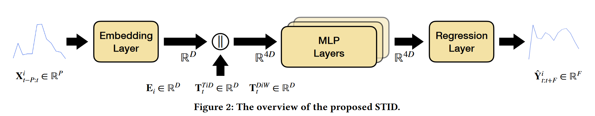

---

#### Two-Stage Attention Layer

[Paper](https://openreview.net/forum?id=vSVLM2j9eie)

*Crossformer: Transformer Utilizing Cross-Dimension Dependency for Multivariate Time Series Forecasting* ICLR'23

[Code](./modules/two_stage_att.py)

[Official Code](https://github.com/Thinklab-SJTU/Crossformer)

[Diagram/Formula](https://openreview.net/forum?id=vSVLM2j9eie)

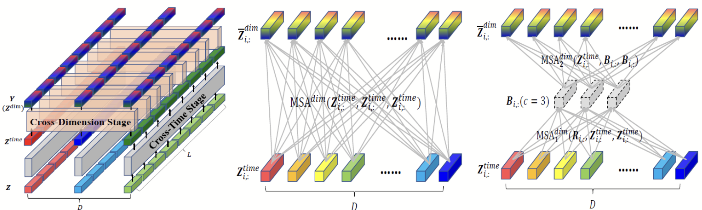

---
